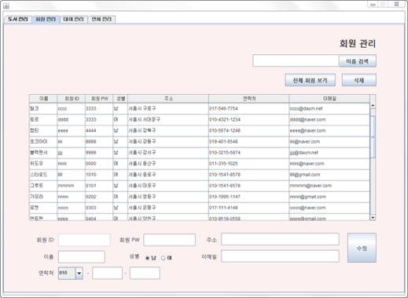

# LibraryManagement

개발 기간 : 19.02.22. ~ 19.02.28.  
팀원 수 : 4명

### 개발 환경

```
O/S : Window7
Java : JDK 1.8
IDE : Eclipse 2018-12
DB : Oracle-XE & Oracle SQL Developer
```

### 정리

- Java Swing package를 이용한 UI 구성
- Java Mail API를 활용한 이메일 인증 및 관리자 이메일 전송 기능
- JDBC API를 활용한 data 삽입, 삭제, 수정 관리와 활용

### UI & 기능 설명

#### 프로그램 시작 화면


- 회원 선택 시 Client 로그인, 관리자 선택 시 Admin 로그인
- 관리자는 회원가입, 아이디 찾기, 비밀번호 찾기 불가
- Client 회원가입 시 이메일 API 사용하여 이메일 인증

<br><br>

#### ClientMain 화면


- 로그인 한 사용자 이름 화면에 출력
- 마이페이지, 도서 검색 기능, 도서관 위치(지도) 확인 기능

<br><br>

#### 도서 검색 화면


- 도서명/저자/출판사/장르 별 검색 가능
- 도서 더블클릭 시 도서 상세정보 확인
- 대여 가능여부에 따라 체크한 항목들을 장바구니에 추가 (하나라도 대여 불가 항목이 체크되면 추가 불가능)

<br><br>

#### 마이페이지


- 현재 사용자의 대여 현황, 장바구니 목록, 대여 기능 및 회원정보 관리
- 대여 현황에는 현재 도서의 반납일과 남은 일짜, 연체 여부가 표시

<br><br>

#### 관리자 모드 1 - 도서관리


- 사용자 검색과 동일하게 도서 검색 및 전체 조회 가능 
- 도서의 추가 및 삭제 가능
- 선택한 도서의 정보 수정 가능

<br><br>

#### 관리자 모드 2 - 회원관리



- 이름으로 회원 검색 및 전체 회원 조회 가능
- 선택한 회원의 정보 수정 가능

<br><br>

#### 관리자 모드 3 - 대여관리


- 회원 이름으로 회원 검색, 도서 이름으로 도서 검색
- 대여하기 버튼과 반납하기 버튼은 기본적으로 비활성화
- 대여하기 : 회원 목록에서 회원 선택 & 도서 목록에서 도서 선택 & 선택한 도서가 대여 가능할 경우
- 반납하기 : 도서 목록에서 도서 선택 & 선택한 도서가 대여중인 도서일 경우

<br><br>

#### 관리자 모드 4 - 연체관리


- 현재 날짜 기준 당일 반납 예정자, 연체 중인 회원 조회, 블랙리스트(누적 연체 횟수 3회 이상) 조회
- 이메일 API를 활용하여 선택한 연체자에게 이메일 전송 가능

<br><br>

